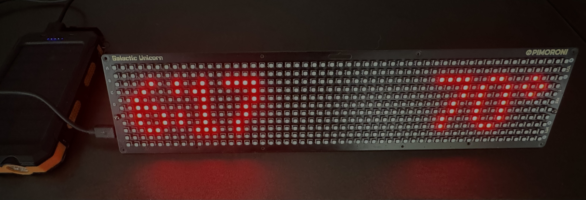

# Galactic Unicorn Clock with Weather Display and Web-based Configuration

This project is a clock and weather display for the Pimoroni Galactic Unicorn, a 53x11 RGB LED display matrix with a Raspberry Pi Pico W. The clock synchronizes time using NTP and displays the current time and temperature on the LED matrix. The temperature data is fetched from the Weather Underground API.



The project also includes a web-based configuration interface that allows users to update the Wi-Fi credentials and Weather Underground API settings without modifying the code directly. The web server is initiated by pressing the A button on the Galactic Unicorn, and the device's IP address is displayed on the LED matrix for easy access.

## Features

- Displays current time and temperature on the Galactic Unicorn LED matrix
- Synchronizes time using NTP (Network Time Protocol)
- Fetches temperature data from the Weather Underground API
- Adjustable UTC offset using the volume up and down buttons
- Web-based configuration interface to update Wi-Fi and Weather Underground API settings
- Download the current `secrets.py` file from the web interface

## Prerequisites

- Pimoroni Galactic Unicorn
- Raspberry Pi Pico W
- MicroPython firmware for the Raspberry Pi Pico W
- Wi-Fi network with internet access
- Weather Underground API key and station ID

## Setup

1. Install the MicroPython firmware on your Raspberry Pi Pico W.
2. Clone this repository or download the `main.py` file.
3. Create a `secrets.py` file in the same directory as `main.py` with the following content:

```python
WIFI_SSID = 'your_wifi_ssid'
WIFI_PASSWORD = 'your_wifi_password'
WUNDERGROUNDAPIKEY = 'your_api_key'
WUNDERGROUNDSTATION = 'your_station_id'
```

Replace `'your_wifi_ssid'`, `'your_wifi_password'`, `'your_api_key'`, and `'your_station_id'` with your actual Wi-Fi credentials, Weather Underground API key, and station ID.

4. Upload the `main.py` and `secrets.py` files to your Raspberry Pi Pico W.
5. Connect the Galactic Unicorn to your Raspberry Pi Pico W.

## Usage

1. Power on your Galactic Unicorn with the Raspberry Pi Pico W.
2. The device will connect to the Wi-Fi network and synchronize the time using NTP.
3. The current time and temperature will be displayed on the LED matrix.
4. Press the volume up and down buttons to adjust the UTC offset if needed.
5. Press the A button to start the web server and display the device's IP address on the LED matrix.
6. Access the web-based configuration interface by entering the displayed IP address in a web browser.
7. Update the Wi-Fi and Weather Underground API settings using the web form.
8. Click the "Download secrets.py" link to download the current `secrets.py` file.
9. The device will restart after updating the settings and use the new configuration.

## Customization

You can customize the clock and weather display by modifying the `main.py` file. The code is well-commented and should be easy to understand and modify.

The A and B buttons on the Galactic Unicorn serve different purposes in this project:

A Button:
- When the A button is pressed, it starts the web server on the device.
- The device's IP address is displayed on the LED matrix, making it easy for users to access the web-based configuration interface.
- The web server listens on port 80 and handles incoming HTTP requests.
- Users can access the web-based configuration interface by entering the displayed IP address in a web browser.
- The web interface allows users to update the Wi-Fi credentials (SSID and password) and the Weather Underground API settings (API key and station ID).
- It also provides a link to download the current `secrets.py` file, which contains the updated configuration.
- After updating the settings and submitting the web form, the device restarts to apply the new configuration.
- The web server runs indefinitely until the device is restarted or powered off.

B Button:
- Pressing the B button triggers an immediate update of the temperature display.
- It forces the device to fetch the current temperature data from the Weather Underground API, regardless of the time elapsed since the last update.
- By default, the temperature is updated every 15 minutes (900 seconds) to avoid excessive API calls.
- Pressing the B button overrides this interval and retrieves the latest temperature data instantly.
- The updated temperature is then displayed on the LED matrix.

Other Relevant Details:
- The volume up and down buttons can be used to adjust the UTC offset.
- Pressing the volume up button increases the UTC offset by 1, while pressing the volume down button decreases it by 1.
- Adjusting the UTC offset allows users to set the correct local time if the device is located in a different time zone.
- The brightness of the LED matrix can be adjusted using the brightness up and down buttons on the Galactic Unicorn.
- Pressing the brightness up button increases the brightness by 0.01, while pressing the brightness down button decreases it by 0.01.
- The device automatically connects to the Wi-Fi network and synchronizes the time using NTP (Network Time Protocol) when powered on.
- If the Wi-Fi credentials or Weather Underground API settings are not configured or are invalid, the device will display an error message on the LED matrix.
- The `secrets.py` file is used to store the sensitive configuration information, such as Wi-Fi credentials and API keys, separately from the main code.
- The `secrets.py` file is not included in the version control system to avoid exposing sensitive information publicly.

These features and functionalities provide a user-friendly way to interact with the Galactic Unicorn clock and weather display, allowing users to easily configure and customize the device using the web-based interface and the physical buttons on the device.

## License

This project is open-source and available under the [MIT License](LICENSE).

Feel free to contribute, provide feedback, or report any issues you encounter.
